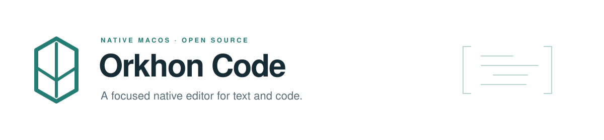

<picture>
  <source media="(prefers-color-scheme: dark)" srcset="docs/assets/readme-dark.svg">
  <source media="(prefers-color-scheme: light)" srcset="docs/assets/readme-light.svg">
  
</picture>

[](https://github.com/dyigitpolat/orkhon-code/actions/workflows/build.yml)
[](LICENSE)


Orkhon Code is a small native macOS editor with a capable editing engine, broad syntax highlighting, rich previews, and terminals that stay out of the way until you need them. No account, telemetry, language server, or extension marketplace.

**[Download](https://github.com/dyigitpolat/orkhon-code/releases) · [Installation guide](docs/INSTALL.md) · [User guide](Resources/User%20Guide.md) · [Contributing](CONTRIBUTING.md)**

## Build and install

On an Apple silicon Mac with macOS 13+, Swift 6+ and Python 3:

```sh
xcode-select --install  # Once, if Apple's command-line tools are missing
git clone https://github.com/dyigitpolat/orkhon-code.git
cd orkhon-code
make install
```

`make install` builds everything and opens **outputs/Orkhon Code Installer.pkg**. Follow macOS Installer; Orkhon opens its welcome page when installation finishes. All dependencies are vendored. Normal builds need **no Node.js, npm, Homebrew, or dependency downloads**. See the [step-by-step guide](docs/INSTALL.md) for prerequisites, upgrades, and troubleshooting.

Release packages are ad-hoc signed and **not Apple-notarized**. Source builds do not require a paid developer account. Maintainers can supply `ORKHON_SIGN_IDENTITY` and `ORKHON_INSTALLER_SIGN_IDENTITY` to use Developer ID certificates before notarization.

## A focused feature set

| Editing | Workspace |
| --- | --- |
| **Scintilla** editing and **Lexilla** highlighting: 145 language profiles | Multiple windows, pinnable tabs, and two editor panes |
| Unified find/replace, regular expressions, multiple selections | Lazy file tree; automatic common parent or explicit folder workspace |
| Comments, indentation, wrapping, encodings, undo and recovery | Native **SwiftTerm** terminal tabs, opened on demand |
| Four coordinated light/dark themes | SSH directories and terminals using system OpenSSH |
| Inline resolution of external edits, with additions and removals marked | Native authentication prompts; key agent and SSH profiles supported |

### File associations that cover everyday text and code

The setup catalog covers **181 reviewed extensions**, including plain text, JSON / JSONC / JSON5, TOML, YAML, Markdown, C/C++, Swift, Python, JavaScript, Rust, Go, configuration files and build scripts. Browse groups by their current app, search the compact list, **uncheck exceptions**, and confirm. Previous defaults are recorded before each change; the result is checked with macOS.

Actual groups depend on macOS and installed apps. Every reviewed text/source format is selectable regardless of its current app, including plain text in TextEdit, logs in Console, and CSV/TSV in Numbers. The setup screen shows the current app and applies changes only after confirmation. On macOS 26.4+, the OS also asks for each changed type; setup previews that count and supports stopping and resuming. HTML, SVG, media, native binary documents and ambiguous formats are excluded from default-app setup. **Finder's Open With menu is independent:** Orkhon registers as an alternate editor for its supported text/source extensions, including HTML and SVG, even when you keep another app as the default. Registration does not write a default-app preference. [Details and shared-extension caveats →](docs/INSTALL.md#file-defaults)

### Markdown with tables, mathematics and diagrams

Preview Markdown or place it next to the source. The renderer supports tables and alignment, task lists, strikethrough, fenced code, links, relative images, safe HTML, **KaTeX formulas** (`$…$`, `$$…$$`, `\(…\)`, `\[…\]`) and **Mermaid diagrams** in fenced `mermaid` blocks.

Rendering uses established open-source libraries: [markdown-it](https://github.com/markdown-it/markdown-it), [KaTeX](https://katex.org/), [Mermaid](https://mermaid.js.org/) and [DOMPurify](https://github.com/cure53/DOMPurify). Everything is bundled locally; there is no runtime CDN dependency. Markdown scripts, event handlers and unsafe links are blocked. HTML file preview is a separate, intentional browser view with relative CSS/JS support.

**Preview work stays off the launch path.** A user-document Markdown preview creates WebKit only when requested. KaTeX loads only for formulas; Mermaid only for diagrams. Unchanged diagrams reuse a bounded cache. Edits debounce for 250 ms with a maximum scheduling delay of one second. Workspace filesystem events use a one-second debounce and three-second maximum scheduling delay, without filtering extensions or requiring files to be tracked by Git. Only visible previews render; hidden tabs invalidate their assets for the next view. macOS uses FSEvents plus direct notifications for open files. SSH uses a small, bundled Python 3 helper over one persistent channel (Linux inotify or macOS FSEvents); it installs nothing on the server. Unsupported/unavailable event monitoring falls back to ten-second reconciliation and retries the event connection. No repository-wide content hashing runs while idle. The built-in welcome page uses lightweight native TextKit.

## Architecture

The UI is AppKit, the editor is Scintilla, syntax comes from Lexilla, and terminals use SwiftTerm. There is no Electron runtime or handwritten highlighting parser.

`ApplicationCoordinator` owns windows and sessions. Each `EditorWindowController` owns documents, a workspace, terminal tabs and two `EditorPane` hosts. Moving a tab transfers its existing Scintilla view and callbacks, preserving its buffer and undo history.

| Boundary | Responsibility |
| --- | --- |
| `Sources/EditorBridge` | Objective-C++ Scintilla/Lexilla adapter |
| `Sources/LumenCore` | Encoding, atomic storage and structured three-way merge |
| `Sources/Lumen/DocumentPreview.swift` | Preview modes, geometry and bounded debounce |
| `Sources/Lumen/RichMarkdownView.swift` | Lazy Markdown web view and isolated resource origins |
| `Sources/Lumen/MarkdownView.swift` | Native welcome-page rendering |
| `Resources/MarkdownPreview` | Vendored, offline browser assets |
| `Sources/Lumen/WorkspaceMonitor.swift` | Recursive local events, remote event channels and reconnects |
| `Resources/workspace_watch.py` | Dependency-free SSH event helper; no server installation |
| `Sources/Lumen/RemoteWorkspace.swift` | OpenSSH transport, quoting, bounded reads and optimistic saves |
| `Sources/SSHAskpass` | Native authentication helper; no credential storage |
| `Sources/Lumen/AssociationPolicy.swift` | Explicit text-format catalog, separate from highlighting coverage |

Commands belong in the relevant window-controller extension, with menus in `Menus.swift` and optional palette entries in `PaletteActions.swift`. Themes live in `Theme.swift`. Language profiles are generated from upstream properties. Add preview formats behind `PreviewKind` and `EditorPane`. Internal Swift target names retain the development codename Lumen; the public bundle identifier is `app.orkhon.editor`.

## Validation and performance

```sh
make verify
```

The complete suite uses real AppKit views, WebKit output and PTYs, so run it in a logged-in macOS desktop. Document fixtures and recovery data are isolated. SSH transport tests use isolated local fixtures. Optional stress tests also exercise a disposable Linux SSH server on loopback; they never use your SSH profiles or connect to a personal server. See [watcher validation](docs/WATCHING.md). CI builds the installer and tests association policy, merging and local SSH operations.

`python3 scripts/benchmark.py` measures fresh release processes with warm filesystem caches. Readiness includes window construction and synchronous AppKit drawing; it excludes Finder dispatch and compositor presentation. Preview and terminal processes start on demand. **A universal sub-100 ms launch guarantee is not established.** Compare distributions on the same Mac rather than a single best run.

Limits: local files 256 MB, remote files 32 MB, Markdown preview 5 MB, HTML live preview 10 MB, automatic merge inputs 8 MB each. Larger conflicts preserve the working buffer and offer Save As. Recovery is best effort, approximately 0.8 seconds after editing. Writes by unrelated programs can still race an optimistic save.

## License

Orkhon Code is [MIT licensed](LICENSE). Upstream licenses remain with each dependency and are bundled in the app. See [dependency versions and provenance](Vendor/DEPENDENCIES.md), [security and data handling](SECURITY.md), and [contribution guidance](CONTRIBUTING.md).
